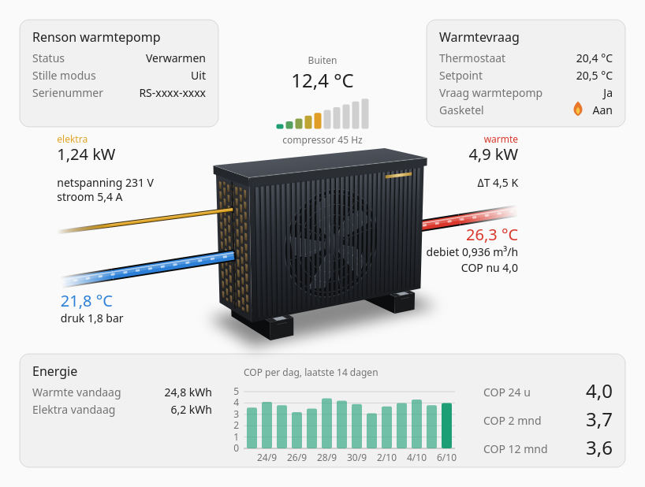

# The dashboard card

The integration brings its own dashboard card: a drawn heat pump with the values around it, where they belong. There is nothing extra to install — the card comes with the integration and is available after a restart.

**What it shows**

- **On the pump:** the fan turns while the heat pump runs, the water flows through the pipes while the pump circulates, and ten bars show how hard the compressor works. In silent mode a moon appears over the fan and it turns slower. In cooling mode red and blue swap sides.
- **Around the pump:** outside temperature, flow and return temperature, flow rate, system pressure, mains voltage and current, and the heat output.
- **In the boxes:** operating state, silent mode and the warranty number; what your thermostat measures, wants and asks for; and an energy overview with the COP per day over the last 14 days and the COP over 24 hours, 2 months and 12 months.

The card only shows; it does not change settings. Tap a value to open its entity. It follows your Home Assistant theme, light or dark, and writes numbers the way your profile says. Its texts are in Dutch or English, following your language.

**Adding it**

Edit a dashboard, choose **Add card** and search for *Renson*. The card fills in the entities of this integration by itself; you can change each one in the editor. In YAML it is `type: custom:renson-arean-card`. The card adapts to the room it gets: in a full-width section or a panel view it is one wide picture, and in a normal section or on a phone it stacks the same parts below each other, so the text keeps the size of the rest of your dashboard. The drawing is never enlarged beyond its design size: in a very wide view the card stays 800 px wide, centred.

After an update a browser can keep running the previous version of the card for a while. The card notices that and shows the message *The Renson Arean card has been updated* at the bottom of the screen: choose **Refresh**.

If the card does not appear in the list after an update, or shows a configuration error in one browser only, that browser still holds an older copy of Home Assistant's pages. Reload the page once without cache (Ctrl+Shift+R). If that does not help, clear the stored data for your Home Assistant address — in Firefox: the padlock in the address bar → **Clear cookies and site data** — and log in again. The first page after that may still show the error for a moment before the card appears. A private window is a quick way to tell: if the card works there, stored data in your normal profile is the cause.

**Electricity and COP need your own meter**

The integration supplies the heat side: the card fills in the heat output and the heat energy counter by itself. It measures no electrical power (see [Long-term statistics](measured-values.md#long-term-statistics)), so the card has optional places for your own sensors:

| In the editor | What to choose | What you get |
|---|---|---|
| Electrical power | your meter's power sensor | power next to "electricity", and the live COP |
| Electrical energy counter | your meter's kWh sensor | electricity today, and all COP figures |
| Gas boiler active | an entity of your own that knows whether the boiler burns | the flame in the heat demand box |

If you clear the heat output entity in the editor, the card calculates the heat output itself, for plain water.

Without your own sensors the card still works: what cannot be shown is left out, with a short note in the energy box saying which sensor is missing. A value that is temporarily unavailable shows as a grey dash, never as zero. The COP figures come from Home Assistant's long-term statistics and are always total heat ÷ total electricity over the period.

The full list of settings is in [`frontend/README.md`](../frontend/README.md).

---

[← Back to the README](../README.md)
